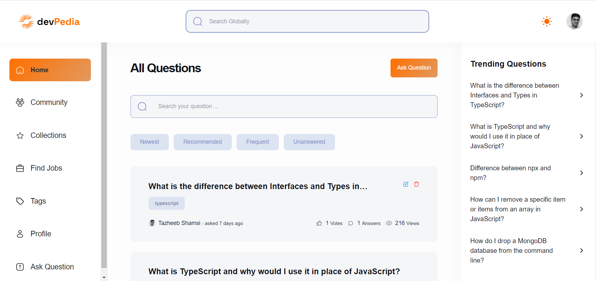
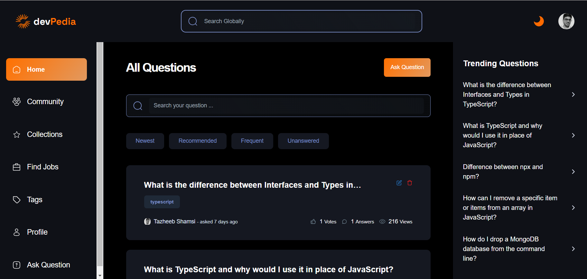

# [devPedia](https://thedevpedia.vercel.app/)

Dev Pedia stands as a community-driven alternative to Stack Overflow, fostering an environment where developers can seek guidance, share insights, and collaborate effectively. Beyond its core Q&A functionality, Dev Pedia is designed as an interactive platform. Developers earn reputation points through various interactions such as upvoting, downvoting, posting questions, and providing answers. The accumulation of these points leads to the awarding of badges, categorized into Bronze, Silver, and Gold, reflecting users' contributions and expertise within the community.







## Table of Contents

- [TechStack](#tech-stack)
- [Installation](#installation)
- [Usage](#usage)
- [Contribution](#contribution)

### Prerequisites

Before you begin, make sure you have the following skill sets:

- [Next.js](https://nextjs.org/)
- [Node.js](https://nodejs.org/)
- [MongoDB](https://www.mongodb.com/)

## Tech Stack

Dev Pedia leverages the following technologies and libraries:

- [Next.js](https://nextjs.org/) - A React framework for building web applications.
- [Clerk](https://docs.clerk.dev/) - Next-generation authentication and user management.
- [MongoDB](https://www.mongodb.com/) - A NoSQL database for storing and retrieving data.
- [Mongoose](https://mongoosejs.com/) - An ODM (Object Data Modeling) library for MongoDB and Node.js.
- [Tailwind CSS](https://tailwindcss.com/) - A utility-first CSS framework for designing user interfaces.
- [TinyMCE](https://www.tiny.cloud/) - A rich text editor for modern web applications.
- [PrismJS](https://prismjs.com/) - A lightweight, extensible syntax highlighter.
- [Typescript](https://www.typescriptlang.org) - A superset of JavaScript that adds static types to the language.
- [shadcn/ui](https://ui.shadcn.com) - Beautifully designed components that you can copy and paste into your apps.
- [React Hook Form](https://react-hook-form.com/) - A library for managing form state and validation in React applications.
- [OpenAI](https://beta.openai.com/) - Integration with the OpenAI API for the Answer Generator AI Bot.

## Installation

### Clone the Repository

```bash
git clone https://github.com/tazheeb-shamsi/dev-pedia.git
cd dev-pedia
```

### Install Dependencies

```bash
npm install
```

###### or

 ```bash
 yarn
 ```

### Set Environment Variables

Create a ```.env.local``` file in the root of the project and add the required environment variables, for this please check out ```env.example```:

### Run the Application

```bash
npm run dev
```

###### or

 ```bash
 yarn dev
 ```

Visit <http://localhost:3000> in your browser to access Dev Pedia.

## Usage

Dev Pedia stands as an open-source alternative to Stack Overflow, serving as a platform where developers can inquire, exchange knowledge, and collaborate through activities such as posting questions, contributing answers, upvoting or downvoting both questions and answers. Notably, our platform also features a specialized Answer Generator AI Bot that can generate responses to specific questions.

##### Key Features

- Open-source alternative to Stack Overflow.
- Platform for developers to ask questions, share knowledge, and collaborate.
- Activities include asking, answering, upvoting, and downvoting questions and answers.
- Specialized Answer Generator AI Bot for generating responses to questions.

## Contribution

We welcome contributions from the community to make Dev Pedia better. If you would like to contribute, follow these steps:

1. Fork the repository.
2. Create a new branch:

   - For adding a feature:

    ```bash
    git checkout -b FEAT/your-branch-name
    ```

   - For bug fixing:

    ```bash
     git checkout -b BUG/your-branch-name
     ```

3. Make your changes and commit: git commit -m 'Add new feature'.
4. Push to there respective branch.
5. Submit a pull request.

Please make sure to follow our code of conduct and contribution guidelines.

##### License

This project is licensed under the MIT License.

Remember to replace placeholders of ```.env.local``` like
`YOUR_CLERK_PUBLISHABLE_KEY`, `YOUR_MONGODB_URL`, etc., with the actual values for your project. Additionally, consider adding more details and sections based on your project's specific requirements.
